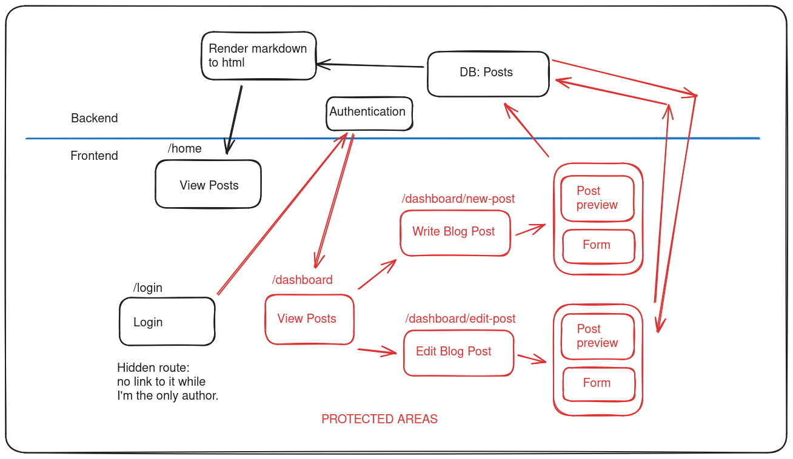

# Planning out my blog application

## Table of Contents

- [What it should do](#what-it-should-do)
  - [Minimum features](#minimum-features)
  - [Intermediate features](#intermediate-features)
  - [Additional features](#additional-features)
- [User Roles](#user-roles)
- [Routes & Pages](#routes--pages)
- [Database Schemas](#database-schemas)
  - [User schema](#user-schema)
  - [Posts schema](#posts-schema)
  - [Comment schema](#comment-schema)
  - [Likes schema](#likes-schema)
- [Next Steps](#next-steps)
- [Rendering Markdown](#rendering-markdown)
- [First Wireframe](#first-wireframe)

## What it should do

### Minimum features

- I can create/edit blog posts (written in markdown)
- Posts can be viewed
- Published & un-published posts (un-published are hidden)

### Intermediate features

- Preview the rendered markdown, eg. toggle panel like github
- Syntax highlight code blocks
- Posts displayed with pagination
- Posts can be filtered & searched
- Posts can have images (from urls)

### Additional features

- Users can comment on posts
- Commenters must sign in
- Users can create their own blog posts
- Posts can have images (uploads)
- Users have a bio page

## User Roles

- Viewer
- Admin
- Commenter
- Author

## Routes & Pages

- /: show posts (pagination)
- /dashboard: display your posts
- /dashboard/write-post
- /dashboard/edit-post

## Database Schemas

I LEARNT: its better not to store arrays of ids, eg. liked_posts: [1, 2, 3]. But have a new table for likes.

### User schema

NOTE: I don't need a user schema to start with if I'm the only blog author. I can just hard code the password in backend (.env).

Some fields I might want:

1. user_id (primary key)
1. username
1. email
1. password_hash
1. full_name
1. created_at
1. updated_at
1. user_role
1. profile_pic
1. bio

### Posts schema

1. post_id (primary key)
1. user_id (foreign key)
1. title
1. content
1. created_at
1. updated_at
1. tags or category: give user choice from predefined tags, limit number that can be added
1. status: draft/ready/published
1. views
1. likes

NOTE: likes should only be allowed by signed in users?

### Comment schema

1. comment_id (primary key)
1. post_id (foreign key)
1. user_id (foreign key)
1. content
1. created_at
1. updated_at

Maybe include likes, upvotes, downvotes. As a way to sort when displaying them.

### Likes schema

This is called a _junction table_ or _association table_.

1. like_id: (primary key)
1. user_id: (foreign key)
1. post_id: (foreign key)

## Next Steps

1. Design UI wireframe: layout, navigation, interactions
2. Routes & Pages: boilerplage & file structure
3. Basic pages/components
4. Database/backend functionality (CRUD)
5. CSS and design

## Rendering Markdown

What packages will I use?

- [marked](https://marked.js.org/) simple markdown parser
- [markdown-it](https://www.npmjs.com/package/markdown-it#syntax-highlighting) markdown parser with pluging, has plugin for highlight.js syntax highlighter
- [highlightjs](https://highlightjs.org/)
- [prismjs](https://prismjs.com/)

Q. Render markdown to html in backend or frontend?

I will render the markdown in the backend, but I will implement the post preview (while authoring posts) in the frontend.

## First Wireframe

